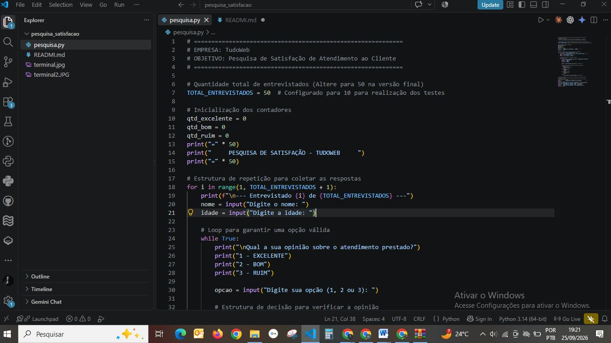
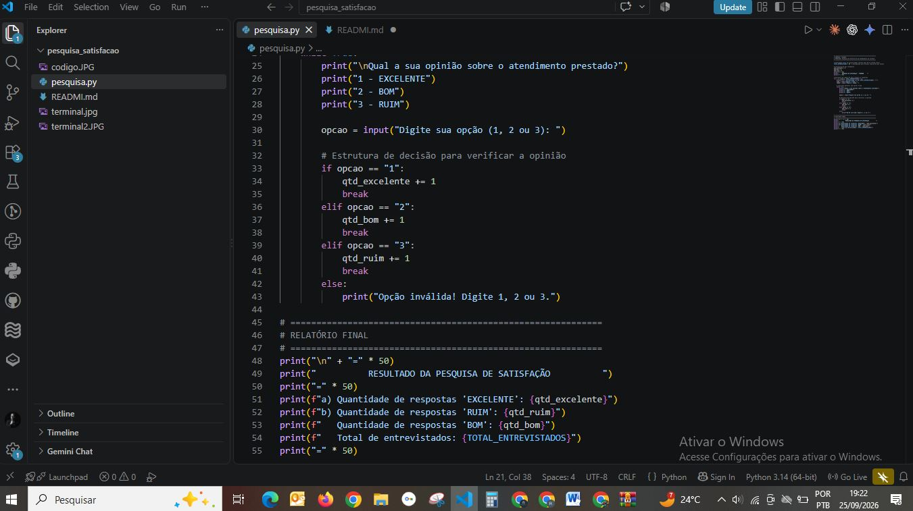
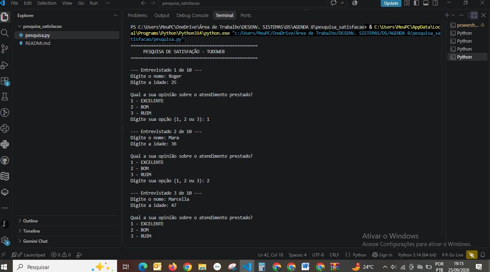
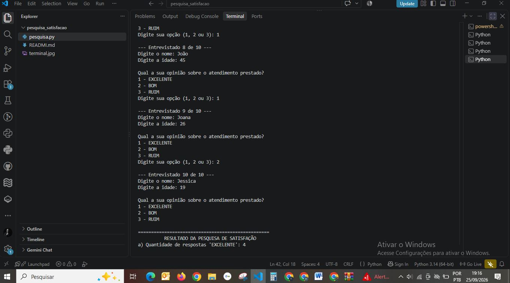

# 📊 Sistema de Pesquisa de Satisfação - TudoWeb

## 🎯 Nome e Objetivo do Sistema

**Nome:** Sistema de Pesquisa de Satisfação do Cliente (TudoWeb)  
**Objetivo:** Coletar, processar e exibir a opinião dos clientes da empresa de marketing **TudoWeb** referente ao atendimento prestado. O programa automatiza a tabulação dos dados de atendimento e apresenta um relatório consolidado com a quantidade de respostas obtidas nas categorias especificados.

---

## 🛠️ Linguagem e Tecnologias

- **Linguagem:** Python 3.x
- **Paradigma:** Programação Estruturada
- **Estruturas do Código:**
  - **Laço de Repetição:** Estrutura `for` para controle de iterações do total de entrevistados e `while` para validação de entrada de menu.
  - **Estruturas Decisórias:** `if`, `elif` e `else` para contagem e categorização das respostas.

---

## 🧮 Fórmulas e Lógica de Cálculo

A tabulação das métricas do sistema utiliza contadores acumulativos baseados nas escolhas do usuário durante a pesquisa.

1. **Contagem por Categoria:**  
   Seja $N$ o total de entrevistados e $O_i \in \{1, 2, 3\}$ a opção informada pelo entrevistado $i$:

   $$Q_{\text{Excelente}} = \sum_{i=1}^{N} \begin{cases} 1 & \text{se } O_i = 1 \\ 0 & \text{se } O_i \neq 1 \end{cases}$$

   $$Q_{\text{Bom}} = \sum_{i=1}^{N} \begin{cases} 1 & \text{se } O_i = 2 \\ 0 & \text{se } O_i \neq 2 \end{cases}$$

   $$Q_{\text{Ruim}} = \sum_{i=1}^{N} \begin{cases} 1 & \text{se } O_i = 3 \\ 0 & \text{se } O_i \neq 3 \end{cases}$$

2. **Totalização de Entrevistados:**  
   $$\text{Total} = Q_{\text{Excelente}} + Q_{\text{Bom}} + Q_{\text{Ruim}}$$

3. **Cálculo de Proporção (Percentual da Categoria):**  
   $$P_{\text{Excelente}} = \left( \frac{Q_{\text{Excelente}}}{N} \right) \times 100$$

   $$P_{\text{Ruim}} = \left( \frac{Q_{\text{Ruim}}}{N} \right) \times 100$$

---

## 📸 Evidências de Teste (10 Entrevistados)

*(Substitua os links abaixo pelas imagens do código e da execução)*

### Código Fonte

### Execução no Terminal

---

